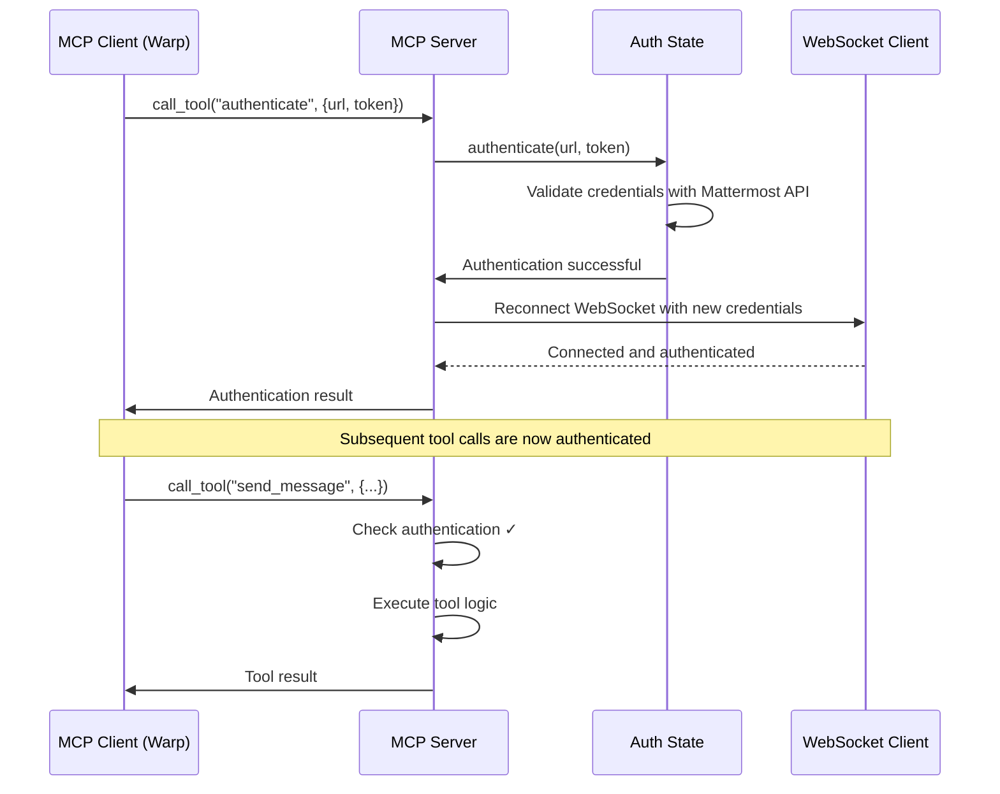

# Authentication Tool Routing and Dynamic Credential Injection

This document describes the implementation of Step 5 in the broader plan: authentication tool routing and dynamic credential injection for the Mattermost MCP server.

## Overview

The implementation ensures that:

1. `authenticate`, `get_auth_status`, and `logout` tools are properly registered through the tool registry
2. After successful authentication, the Mattermost streaming client reconnects automatically
3. Authentication status is properly reflected in subsequent tool and resource calls
4. All tool and resource access fails fast when not authenticated (except auth tools themselves)

## Implementation Details

### 1. Tool Registration

**File: `mcp_mattermost/tools/auth.py`**

The authentication tools have been converted from class-based to function-based implementations using the `@mcp_tool` decorator pattern:

- `authenticate` - Authenticates with Mattermost using API credentials
- `get_auth_status` - Returns current authentication status
- `logout` - Clears authentication state

All tools are automatically registered with the global tool registry when the module is imported.

### 2. WebSocket Reconnection

**File: `mcp_mattermost/server.py`**

- Added `_reconnect_websocket_client()` method that handles WebSocket reconnection after authentication
- Registered authentication callback in server initialization to trigger reconnection
- WebSocket client is properly disconnected and reconnected with new credentials
- Graceful handling of reconnection failures (authentication succeeds even if streaming fails)

### 3. Authentication Enforcement

**File: `mcp_mattermost/stdio_server.py`**

- Added authentication checks to `handle_call_tool()` and `handle_read_resource()` handlers
- Authentication tools (`authenticate`, `get_auth_status`, `logout`) are exempt from authentication checks
- All other tools and resources require authentication before access
- Proper error responses are returned for unauthorized access attempts

**File: `mcp_mattermost/tools/auth.py`**

- Added `check_authentication()` utility function for fast authentication checking
- Added `require_authentication` decorator for tools that need authentication
- Clear error messages for unauthorized access attempts

### 4. Dynamic Credential Injection

The authentication system supports dynamic credential provision:

- Credentials are provided by the MCP client (Warp) at runtime through the `authenticate` tool
- No hardcoded credentials in environment variables required
- Authentication state is managed globally and accessible to all components
- Authentication callbacks allow components to react to authentication changes

## Authentication Flow



## Key Features

### Fast Failure on Unauthorized Access

- Tool calls fail immediately if not authenticated (except auth tools)
- Resource access is blocked until authentication is provided
- Clear error messages guide users to authenticate first

### Automatic WebSocket Reconnection

- WebSocket streaming client automatically reconnects after successful authentication
- Existing connections are gracefully disconnected before reconnecting
- Streaming continues to work with new credentials
- Failure to reconnect WebSocket doesn't fail the authentication (API still works)

### Authentication State Management

- Global authentication state accessible throughout the application
- Authentication callbacks for components that need to react to auth changes
- Proper cleanup of authentication state on logout
- Persistent authentication info for debugging and status checking

## Usage Examples

### Authentication

```bash
# Through MCP protocol
{
  "method": "tools/call",
  "params": {
    "name": "authenticate",
    "arguments": {
      "mattermost_url": "https://your-mattermost.com",
      "token": "your-api-token",
      "team_id": "optional-team-id"
    }
  }
}
```

### Check Authentication Status

```bash
{
  "method": "tools/call",
  "params": {
    "name": "get_auth_status",
    "arguments": {}
  }
}
```

### Logout

```bash
{
  "method": "tools/call",
  "params": {
    "name": "logout",
    "arguments": {}
  }
}
```

## Testing

The implementation includes comprehensive test coverage:

- Authentication tools are properly registered
- Tool registry correctly routes authentication calls
- Authentication checking works as expected
- WebSocket reconnection callbacks are functional
- Unauthorized access is properly blocked

Run tests with:
```bash
python -m pytest tests/ -v -k "not test_integration"
```

## Files Modified

1. `mcp_mattermost/tools/auth.py` - Converted to function-based tools with proper registration
2. `mcp_mattermost/server.py` - Added WebSocket reconnection callback
3. `mcp_mattermost/stdio_server.py` - Added authentication checks to tool/resource handlers
4. `mcp_mattermost/auth.py` - Added callback notification support (pre-existing)

## Security Considerations

- Credentials are never logged or persisted to disk
- Authentication state is cleared on logout
- WebSocket connections use the same security as the API
- Tool access is properly gated by authentication status
- Error messages don't leak sensitive information

## Future Enhancements

- Consider adding token refresh/renewal functionality
- Add metrics for authentication events
- Support for multiple authentication methods
- Session timeout and re-authentication handling
