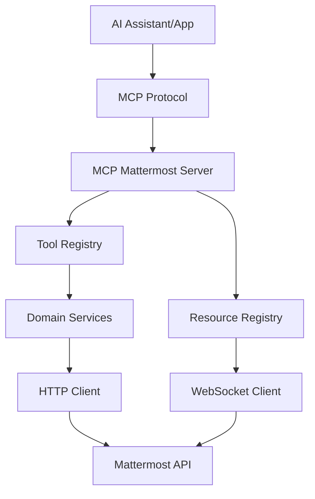

# Mattermost MCP Python

[](LICENSE)
[][python-org]
[][mcp-protocol]

A comprehensive Model Context Protocol (MCP) server implementation for Mattermost integration, enabling AI assistants to seamlessly interact with Mattermost channels, users, and messaging features.

## 🚀 Quick Start

**Docker Compose (Recommended)**
```bash
git clone [Repository](https://github.com/cronus42/mattermost-mcp-python.git)
cd mattermost-mcp-python
cp .env.example .env
# Edit .env with your Mattermost configuration
docker-compose up -d
```

🔗 [GitHub](https://github.com/cronus42/mattermost-mcp-python)

**Manual Installation**
```bash
pip install mattermost-mcp-python
python -m mcp_mattermost
```

### Table of Contents
- [🚀 Quick Start](#-quick-start)
  - [Docker Compose (Recommended)](#option-1-docker-compose-recommended)
  - [Python Installation](#option-2-python-installation)
- [✨ Features](#-features)
  - [🔌 MCP Server](#-mcp-server)
  - [🌐 Advanced HTTP Client](#-advanced-http-client)
  - [📊 Typed Models](#-typed-models)
  - [🔧 Domain Services](#-domain-services)
  - [📡 Real-time Capabilities](#-real-time-capabilities)
  - [🛠️ Developer Experience](#%EF%B8%8F-developer-experience)
  - [🚀 CI/CD Pipeline](#-cicd-pipeline)
- [Installation](#installation)
- [Configuration](#configuration)
- [📖 Documentation](#-documentation)
- [🛠️ Available Tools](#%EF%B8%8F-available-tools)
  - [💬 Messaging](#-messaging)
  - [🏗️ Channel Management](#-channel-management)
  - [👥 User Operations](#-user-operations)
  - [📁 File Handling](#-file-handling)
- [💡 Usage Examples](#%EF%B8%8F-usage-examples)
  - [Send a Message](#send-a-message)
  - [Create Channel and Add Users](#create-channel-and-add-users)
  - [Real-time Monitoring](#real-time-monitoring)
- [🎯 Use Cases](#-use-cases)
- [🏗️ Architecture](#%EF%B8%8F-architecture)
- [Development](#development)
- [Contributing](#contributing)
- [License](#license)
- [Support](#support)

## ✨ Features

### 🔌 **MCP Server**
- Full Model Context Protocol server implementation
- Real-time streaming resources with WebSocket support
- REST API polling fallback for reliability
- Comprehensive tool catalog with 20+ tools

### 🌐 **Advanced HTTP Client**
- Async HTTP client with automatic retries and exponential backoff
- Built-in rate limiting and circuit breaker patterns
- Comprehensive error handling and logging
- SSL/TLS support with certificate validation

### 📊 **Typed Models**
- Complete Pydantic models for all Mattermost entities
- Runtime validation and serialization
- OpenAPI schema generation from official Mattermost specs
- Type-safe API interactions

### 🔧 **Domain Services**
- **UsersService**: User management, authentication, search, and profiles
- **TeamsService**: Team operations, membership management, and invitations  
- **ChannelsService**: Channel CRUD, membership, and statistics
- **PostsService**: Post creation, editing, search, reactions, and threads
- **FilesService**: File upload, download, metadata, and attachment management

### 📡 **Real-time Capabilities**
- WebSocket streaming for live updates
- Resource-based streaming architecture
- Automatic reconnection and failover
- Configurable polling intervals

### 🛠️ **Developer Experience**
- Complete type hints and IDE support
- Comprehensive error handling with custom exception types
- Structured logging with correlation IDs
- Extensive test coverage with pytest
- Full CI/CD pipeline with GitHub Actions

### 🚀 **CI/CD Pipeline**
- Automated linting (flake8, black, isort)
- Type checking with mypy across Python 3.8-3.12
- Comprehensive testing with pytest and coverage
- Automated PyPI publishing on releases
- Pre-commit hooks for development

## Installation

1. Clone the repository:
```bash
git clone https://github.com/cronus42/mattermost-mcp-python.git
cd mattermost-mcp-python
```

2. Create and activate a virtual environment:
```bash
python3 -m venv .venv
source .venv/bin/activate  # On Windows: .venv\Scripts\activate
```

3. Install dependencies:
```bash
pip install -r requirements.txt
```

4. Set up your environment variables:
```bash
cp .env.example .env
# Edit .env with your Mattermost configuration
```

## Configuration

Copy `.env.example` to `.env` and configure the following variables:

- `MATTERMOST_URL`: Your Mattermost instance URL
- `MATTERMOST_TOKEN`: Your Mattermost API token
- `MATTERMOST_TEAM_ID`: Team ID to connect to (optional)

## 📖 Documentation

- **[📚 Complete Documentation](docs/README.md)** - Full documentation index
- **[🚀 Quick Start Guide](docs/quickstart.md)** - Get running in 5 minutes
- **[🏗️ Architecture Overview](docs/architecture.md)** - System design and components
- **[🛠️ Tool Catalog](docs/tools/README.md)** - All available MCP tools
- **[📝 Usage Examples](docs/examples/README.md)** - Practical code examples
- **[⚙️ Configuration Guide](docs/configuration.md)** - Comprehensive configuration
- **[🐳 Docker Deployment](docker-compose.yml)** - Production-ready setup

## 🚀 Quick Start

### Option 1: Docker Compose (Recommended)

```bash
# Clone and setup
git clone [Repository](https://github.com/cronus42/mattermost-mcp-python.git)
cd mattermost-mcp-python
cp .env.example .env

docker-compose up -d

# Edit .env with your Mattermost configuration
# Then start all services:

# Access:
# - **Mattermost**: [localhost:8065](http://localhost:8065)
# - **MCP Server**: [localhost:3000](http://localhost:3000)
# - **Health Check**: [localhost:3000/health](http://localhost:3000/health)
```

### Option 2: Python Installation

```bash
pip install mattermost-mcp-python

# Set environment variables
export MATTERMOST_URL="https://your-mattermost.com"
export MATTERMOST_TOKEN="your-bot-token" 
export MATTERMOST_TEAM_ID="your-team-id"

# Run the server
python -m mcp_mattermost
```

## 🛠️ Available Tools

MCP tools for Mattermost integration:

### 💬 Messaging
- `send_message` - Send messages to channels
- `reply_to_thread` - Reply to message threads  
- `get_channel_history` - Retrieve message history
- `add_reaction` / `remove_reaction` - Emoji reactions
- `pin_message` / `unpin_message` - Pin important messages

### 🏗️ Channel Management  
- `list_channels` - List team channels
- `create_channel` - Create new channels
- `add_user_to_channel` - Manage channel membership
- `get_channel_stats` - Channel statistics
- `search_channels` - Find channels by name/topic

### 👥 User Operations
- `get_user` / `search_users` - User information
- `get_user_status` - User presence status

### 📁 File Handling
- `upload_file` - Upload file attachments
- `get_file_info` - File metadata
- `download_file` - Download files

[**→ See complete tool catalog**](docs/tools/README.md)

## 💡 Usage Examples

### Send a Message

```python
import asyncio
from mcp_client import MCPClient

async def send_hello():
    async with MCPClient("http://localhost:3000") as client:
        result = await client.call_tool("send_message", {
            "channel_id": "your-channel-id",
            "message": "Hello, Mattermost! 🎉"
        })
        print(f"Message sent: {result['post_id']}")

asyncio.run(send_hello())
```

### Create Channel and Add Users

```python
async def setup_project():
    async with MCPClient("http://localhost:3000") as client:
        # Create private channel
        channel = await client.call_tool("create_channel", {
            "team_id": "your-team-id",
            "name": "project-alpha", 
            "display_name": "Project Alpha",
            "type": "P",  # Private
            "purpose": "Alpha project discussions"
        })
        
        # Add team members
        for user_id in ["user1", "user2", "user3"]:
            await client.call_tool("add_user_to_channel", {
                "channel_id": channel["channel_id"],
                "user_id": user_id
            })
        
        # Welcome message
        await client.call_tool("send_message", {
            "channel_id": channel["channel_id"],
            "message": "🚀 Welcome to Project Alpha!"
        })
```

### Real-time Monitoring

```python
async def monitor_activity():
    async with MCPClient("http://localhost:3000") as client:
        # Subscribe to real-time updates
        async for update in client.subscribe_to_resource("channel_posts"):
            if "help" in update["message"].lower():
                # Auto-respond to help requests
                await client.call_tool("add_reaction", {
                    "post_id": update["post_id"],
                    "emoji_name": "eyes",
                    "user_id": "bot-user-id"
                })
```

[**→ See more examples**](docs/examples/README.md)

## 🎯 Use Cases

- **🤖 Chatbots & AI Assistants** - Build conversational interfaces
- **📢 Notifications & Alerts** - Automated system notifications  
- **🔄 Workflow Automation** - Process automation with Mattermost
- **📊 Monitoring Dashboards** - Real-time activity monitoring
- **🔗 System Integration** - Connect external services
- **📋 Report Generation** - Automated reporting to channels
- **🎮 Interactive Commands** - Custom slash commands and workflows

## 🏗️ Architecture



**Key Components:**
- **Tool Registry** - 20+ MCP tools for Mattermost operations
- **Resource Registry** - Real-time streaming resources
- **Domain Services** - High-level business logic layer
- **HTTP Client** - Robust API client with retry/rate limiting
- **WebSocket Client** - Real-time event streaming

[**→ Detailed architecture**](docs/architecture.md)

### Development

Install development dependencies:
```bash
pip install -r requirements-dev.txt
```

Run tests:
```bash
pytest
```

## Contributing

1. Fork the repository
2. Create a feature branch
3. Make your changes
4. Add tests if applicable
5. Submit a pull request

## License

[Add your license information here]

## Support

For issues and questions, please open an issue on the [GitHub repository][github-repo].

---

<!-- Reference Links -->
[github-repo]: https://github.com/cronus42/mattermost-mcp-python
[python-org]: https://python.org
[mcp-protocol]: https://modelcontextprotocol.io
[localhost-8065]: http://localhost:8065
[localhost-3000]: http://localhost:3000
[localhost-health]: http://localhost:3000/health
