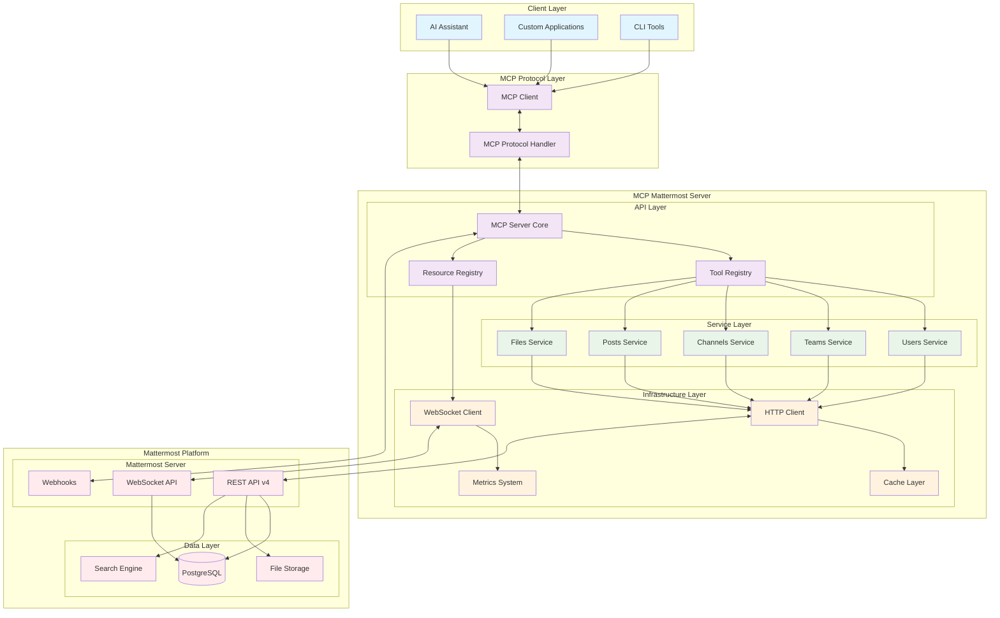

# 🏗️ Architecture Overview

This document provides a comprehensive overview of the Mattermost MCP Python architecture, including system design, component interactions, and data flow patterns.

## System Architecture Diagram



## Core Components

### 1. MCP Server Core

The central component that implements the Model Context Protocol specification.

**Responsibilities:**
- Handle MCP protocol messages (JSON-RPC 2.0)
- Route requests to appropriate tools and resources
- Manage connection lifecycle and error handling
- Coordinate between different service layers

**Key Features:**
- Async/await based architecture
- Structured logging with correlation IDs
- Comprehensive error handling
- Health checks and metrics

### 2. Tool Registry

Manages and exposes MCP tools for external clients.

**Available Tool Categories:**
- **Messaging Tools**: Send messages, reply to threads, manage reactions
- **Channel Tools**: Create/manage channels, handle memberships
- **User Tools**: User management and profile operations
- **File Tools**: Upload/download files, manage attachments
- **Admin Tools**: System administration and monitoring

**Tool Implementation Pattern:**
```python
@mcp_tool(
    name="send_message",
    description="Send a message to a channel",
    input_schema={...}
)
async def send_message_tool(**kwargs):
    # Tool implementation
    pass
```

### 3. Resource Registry

Manages streaming resources that provide real-time updates.

**Available Resources:**
- **Channel Posts Stream**: New posts in monitored channels
- **Reaction Stream**: Emoji reactions on posts
- **User Status Stream**: User presence and status changes
- **Team Events Stream**: Team membership changes

**Resource Types:**
- **Polling Resources**: Use REST API with configurable intervals
- **Streaming Resources**: Use WebSocket for real-time updates
- **Hybrid Resources**: Automatic failover between streaming and polling

### 4. Service Layer

High-level domain services that encapsulate business logic.

#### Users Service
```python
class UsersService:
    async def get_me(self) -> User
    async def get_user(self, user_id: str) -> User
    async def search_users(self, term: str) -> List[User]
    async def get_user_status(self, user_id: str) -> UserStatus
    async def update_user_status(self, status: UserStatusUpdate)
```

#### Channels Service
```python
class ChannelsService:
    async def get_channels_for_team(self, team_id: str) -> List[Channel]
    async def create_channel(self, channel_data: ChannelCreate) -> Channel
    async def add_channel_member(self, channel_id: str, user_id: str)
    async def get_channel_stats(self, channel_id: str) -> ChannelStats
```

#### Posts Service
```python
class PostsService:
    async def create_post(self, post_data: PostCreate) -> Post
    async def get_posts_for_channel(self, channel_id: str) -> PostList
    async def add_reaction(self, user_id: str, post_id: str, emoji: str)
    async def get_post_thread(self, root_post_id: str) -> PostList
```

### 5. Infrastructure Layer

#### HTTP Client
- **Async HTTP client** with automatic retry logic
- **Rate limiting** with token bucket algorithm
- **Circuit breaker** pattern for fault tolerance
- **Request/response logging** with correlation tracking
- **SSL/TLS support** with certificate validation

**Features:**
```python
client = AsyncHTTPClient(
    base_url="https://mattermost.com/api/v4",
    token="bot-token",
    timeout=30.0,
    max_retries=3,
    retry_backoff_factor=2.0,
    rate_limit_requests_per_second=10
)
```

#### WebSocket Client
- **Real-time event streaming** from Mattermost
- **Automatic reconnection** with exponential backoff
- **Event filtering** and routing
- **Connection health monitoring**

#### Cache Layer
- **In-memory caching** for frequently accessed data
- **TTL-based expiration** for cache entries
- **Cache warming** strategies
- **Memory-efficient storage**

#### Metrics System
- **Request/response metrics** (latency, count, errors)
- **Resource utilization** tracking
- **Custom business metrics**
- **Health check endpoints**

## Data Flow Patterns

### 1. Tool Execution Flow

```
1. Client Request → MCP Server
2. Server validates request → Tool Registry
3. Tool Registry routes → Specific Tool
4. Tool calls → Service Layer
5. Service makes → HTTP API Call
6. Response flows back through layers
7. Result returned → Client
```

### 2. Resource Streaming Flow

```
1. Resource Registration → Server startup
2. WebSocket Connection → Mattermost
3. Event Received → WebSocket Client
4. Event Filtered → Resource Registry
5. Resource Update → Subscribers
6. Client Notification → MCP Protocol
```

### 3. Error Handling Flow

```
1. Error Occurs → Any Layer
2. Error Wrapped → Custom Exception
3. Error Logged → Structured Logger
4. Error Metrics → Metrics System
5. Error Response → Client (with correlation ID)
```

## Security Architecture

### Authentication & Authorization
- **Bot Token Authentication**: Secure API token management
- **Permission Validation**: Check user permissions before operations
- **Rate Limiting**: Prevent abuse and ensure fair usage
- **Input Validation**: Comprehensive request validation

### Data Protection
- **TLS Encryption**: All external communications encrypted
- **Token Storage**: Secure credential management
- **Audit Logging**: Comprehensive operation logging
- **Error Sanitization**: No sensitive data in error messages

## Scalability Considerations

### Horizontal Scaling
- **Stateless Design**: No server-side session state
- **Load Balancing**: Multiple server instances behind load balancer
- **Shared Cache**: Redis for distributed caching
- **Database Pooling**: Connection pool management

### Performance Optimization
- **Async Architecture**: Non-blocking I/O operations
- **Connection Pooling**: Reuse HTTP connections
- **Bulk Operations**: Batch API calls when possible
- **Caching Strategy**: Multi-level caching (memory, Redis)

### Resource Management
- **Memory Limits**: Configurable memory usage bounds
- **Connection Limits**: Maximum concurrent connections
- **Rate Limiting**: Per-client and global rate limits
- **Graceful Degradation**: Fallback mechanisms

## Monitoring & Observability

### Health Checks
```http
GET /health
{
  "status": "healthy",
  "components": {
    "mattermost_api": "ok",
    "websocket": "ok",
    "cache": "ok",
    "database": "ok"
  }
}
```

### Metrics Endpoints
```http
GET /metrics
# Prometheus-format metrics
mcp_requests_total{method="send_message"} 1543
mcp_request_duration_seconds{method="send_message"} 0.125
mcp_websocket_connections 5
```

### Logging Structure
```json
{
  "timestamp": "2024-01-15T10:30:00Z",
  "level": "INFO",
  "logger": "mcp_mattermost.services.posts",
  "correlation_id": "req-123456",
  "message": "Post created successfully",
  "context": {
    "user_id": "user123",
    "channel_id": "channel456",
    "post_id": "post789"
  }
}
```

## Configuration Architecture

### Environment-Based Config
```bash
# Core settings
MATTERMOST_URL=https://mattermost.company.com
MATTERMOST_TOKEN=bot-token-here

# Performance tuning
HTTP_TIMEOUT=30
MAX_RETRIES=3
RATE_LIMIT_RPS=10

# Feature flags
ENABLE_WEBSOCKET=true
ENABLE_CACHING=true
ENABLE_METRICS=true
```

### Dynamic Configuration
- **Runtime configuration updates** via API
- **Feature flag management** for gradual rollouts
- **Environment-specific overrides**
- **Configuration validation** at startup

## Development Architecture

### Code Organization
```
mcp_mattermost/
├── api/              # HTTP client and API wrappers
├── models/           # Pydantic data models
├── services/         # Business logic layer
├── tools/            # MCP tool implementations
├── resources/        # MCP resource implementations
├── server.py         # Main MCP server
└── __main__.py       # Entry point
```

### Extension Points
- **Custom Tools**: Add new MCP tools
- **Custom Resources**: Add new streaming resources
- **Service Extensions**: Extend existing services
- **Middleware**: Add request/response middleware

This architecture provides a robust, scalable foundation for Mattermost integration while maintaining clean separation of concerns and excellent developer experience.
